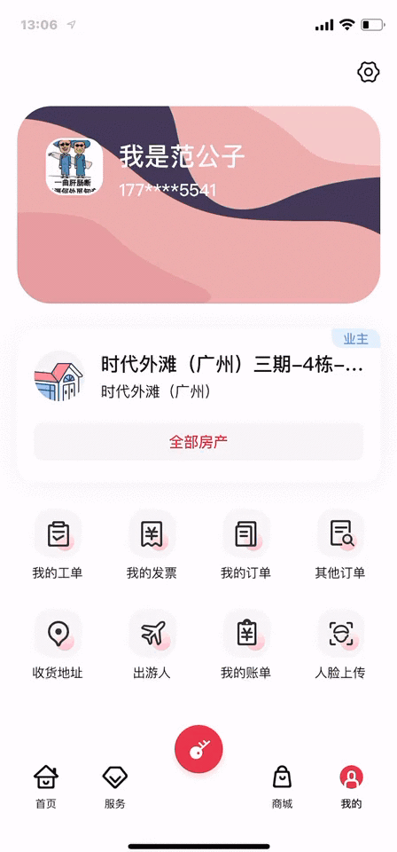

# X-engine 简介

x-engine 是一个跨端模块管理框架，它的定位就是是客户端的 Spring，管理 bean（模块）。

x-engine 的目的并不是做“另一个跨平台”框架，

因为这样的框架太多了，从时间上，先是 cordova/capacitor/ionic，到 react-native, 到 flutter。

总结下来就这几种模式：

native + h5  : cordova 

h5 -> native  : reactie-native  weex 
self-render   : flutter

native + web- : 小程序

没有谁好谁坏, 但在选择某个方案前,你都得关注这几个点:

项目目标, 可维护性, 可扩展性, 可协作性, 开发效率, 开发人员门槛, 开发技术的隔离.

cordova/capacitor/ionic 的问题在于, 它是以 h5 为主.原生为辅. 这就让原生很尴尬,最终会沦为插件转换器. 但 h5 也很尴尬,只要涉及到原生.完全摸不着北.

reactie-native  的问题在于, 它丢弃了 h5 很多东西. 如果你真又要开发效率又要原生性能.也许是个不错的选择.

flutter 就是更尴尬. 半路出家的 native 开发者去玩 flutter. 总有一种突然能先写两端的幻觉. 但出问题能不能 hold 住是个非常大的问号. 能不能 google 到答案基本是 99% flutter 开发人员的上限.

x-engine 的优势在于, 原生为主. 由原生主导. x-engine 以 sdk 的形式集成. 

提供完善的路由. 安全, 热更新,模块机制.

这会让原生与 h5 的开发人员对x-engine 都不会有上手的困扰. 

通过模块的组合，我们可以快速复用已有的 hybrid 框架，甚至还可以自造一个 hybrid 框架。比如 MicroApp 

## MicroApp

它是一套基于 x-engine 的 Hybrid 轻量解决方案。 通过几个模块的简单组合,就能使你的 app 具有类似微信小程序的能力. 

支持的功能包含：

- 离线更新.
- 增强 JS 的能力.
- 统一路由.(原生,h5,微应用,wgt,等)

当然,我们知道微信小程序是view 与 logic 分离的. 这样做的好处一是api 可控,更安全, 二是可以在 view 的渲染器上做点文章. 

但一定要这样做么?  得看你是不是微信

首先说安全, 微信想要控制一切 api. 但如果你是一家企业, 应用全是你自己开发. 那只要控制好离线包的分发,模块api权限, 网络,与数据访问的安全问题.  

再说渲染器, 按现在 vue ,react 的模式, 自定义渲染器完全不需要按小程序这种形式实现. 因为它们天然就支持.

微信小程序带来了view 层与 logic 层通信的严重负担.  更多的在于安全.

老生常谈的 Hybrid 的白屏问题, Microapp 方案已尽量避免. 需要几方面努力, 

1. 代码的得按最佳微应用范式写.
2. 做成离线包.
3. 引擎做界面的视觉优化.

那白屏问题基本就肉眼不可见. 如下演示.

x-engine 并不会试图再去造一套 “小程序” DSL，而是可以根据业务需求, 快速模块化. 

这也意味着 Vue，React，Angular 任何 H5 / SPA 的开发框架都可以是我们选型对象。 

x-engine 将会全面开源，包括核心源码。在出问题时，你能跟踪到任何一端直到不属于我们的源码。 

# 资源地址

源码:[github](https://github.com/zkty-team/monorepo) （当前仅开发人员可见）

真机基座下载:[下载地址](https://www.pgyer.com/engine-motherboard)

