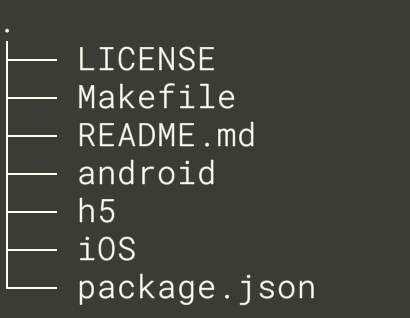

模块由 3 部分构成. js api ,ios 实现, android 实现.


模块模板会多包含一层 x-engine, 以供开发者调试测试用. 在发布后将不会包含. 见下文[模板目录结构].


**重点：模块禁止依赖模块。 模块必须依赖接口，接口定义在 x-engine-module-protocols 内。**


## 模板目录结构



## 模块组织

所有的模块都在 npm 里管理, 用 npm 管理会遇到几个问题,

一个是依赖的依赖.

一个是自动注册.


## 权限申请

将各平台所需要的权限在 README.md 里明确说明。 


## api 约定

开发前要约定好3 端 api， 具体可参考 [x-cli model.ts 章节](./docs/product/x-cli?id=model)。


## 版本号约定

所有的模块版本号以 package.json 的版本号为准。在发布时，js，iOS，android（todo） 会自动同步 package.json 里的版本号。

<大版本>.<中版本>.<小版本>

|        | api 返回值修改 | api 增加 | api 删除 | api 修内部 bug |
| ------ | -------------- | -------- | -------- | -------------- |
| 大版本 | ^              |          | ^        |                |
| 中版本 |                | ^        |          |                |
| 小版本 |                |          |          | ^              |


## 模块扫描与注册


iOS/android 里的模块实现类以 `__xengine__module_` 开头， 如 `__xengine__module_bluetooth`,  以供 iOS/android 自动注册用。

**xengine__module_BaseModule 类**

是所有模块的基类, 定义了模块的通用方法, 基础方法现有(伪代码)

``` oc 

// 子类的 moduleId / namespace
- (string) moduleId {throw exception("子类必须实现")};

// 模块在被回调时, 触发的顺序,越小越早触发
- (int)    order{return 0;};

// 在所有模块都初始化完后, 按照 order 的顺序, 引擎回调通知, 这里可以手动将模块依赖的 protocol/interface 注入.
-(void) onAllMoudlesInited(Engine* engine);
```


> protocol 与 interface 在这里是一个意思.


