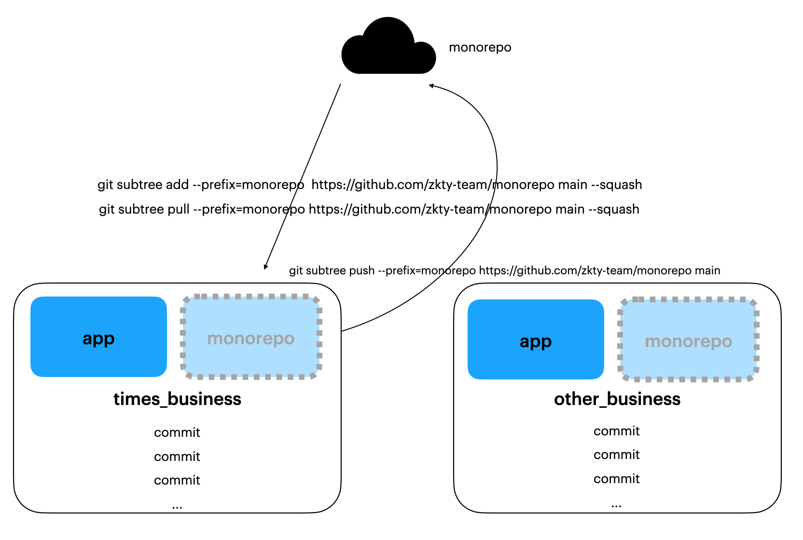

# 引擎引用方式

旧项目将拆分 monorepo

 


# 服务端


## 微应用离线管理服务

微应用包安全为了防止包被他人篡改. 即便有中间人攻击的情况下.

x-engine-app.json

``` json
{
  "appid":"",
  "pub_key":"",
  "digest_method":"md5" // default, 放微应用里还是 x-engine-app.json 里?
}
```


```
digest: 根据安全级别定义,默认 md5 算法
```

### 流程图

``` mermaid
sequenceDiagram
	  autonumber
    participant s as 微应用离线服务 
    participant r as 资源服务
    participant b as 业务服务
	  participant u as 微应用.zip 开发者  
    participant a as App 开发者


    b-->>s: 创建应用 api
   	s-->>s: 生成 App 公私钥, p0, p1
		s-->>b: 返回 app id 与公钥
   	a-->>a: embed App 公钥 p0
   	u->>b: 上传微应用appid+ m1.zip包 api
   	b->>s: 上传微应用appid+ m1.zip包 api
   	s->>s: 用 p1 对微应用.zip digest(md5(m1.zip)) 值签名 
	  s-->>r: 提交到资源服务器
	  s-->>b: 签名成功,返回资源地址
	  b-->>b: 绑定app id 与 微应用 m1.zip 关系
	  b-->>u: 返回结果
	  
	  a->>b: 拉取路由例表
	  b->>a: 返回路由例表
	  a->>a: 用 p0 验证 digest(md5(m1)) 是否合法
    a->>a: 打开  m1.zip
    

```

### 对外接口

服务名 offline-service

返回封装:

```
{
	code: int,        // 0 代表成功, 其他错误自行定义
	message: string,  // 错误说明
	data: Array | Object
}
```


#### 创建 app

POST  /offline-service/app

body

``` json
{
  "appname":""
}
```

返回

``` json
code:0,
message:""
data:{
  "appid":"",
  "appname":"appname",
  "publicKey":"",
  "method":"" // 生成非对称钥匙算法
}
```


#### 修改 app

PUT   /offline-service/app/{appid}

body

``` json
{
  "appname":"appname",
}
```

返回

``` json
code:0,
message:""
data:{
  "appid":"",
  "appname":"appname",
  "publicKey":"",
  "method":"" // 生成非对称钥匙算法
}
```


 

#### 上传 microapp

POST  /microapp-service/app/{appid}/microapp

参数
``` 
microappId: string, (微应用 id) 例:com.zzzz.moudle.xxx
name:   string  微应用名称
file: Binary  (zip 文件)
```

返回

```
{
  code: i0
  message:""
  data:{
     microappId: "com.zzzz.moudle.xxx"
     version: 0   
     url:string
  } 
}
```


#### 修改 microapp

PUT  /microapp-service/app/{appid}/microapp

请求

``` json
microappId: string, (微应用 id) 例:com.zzzz.moudle.xxx
version: int 版本号
name:   string  微应用名称
file: Binary  (zip 文件)
```


返回

``` json {
  code: i0
  message:""
  data:{
     microappId: "com.zzzz.moudle.xxx"
     version: 0   
     url:string
  } 
}
```


#### 拉取 microapp 例表

GET /microapp-service/app/{appid}/microapps

返回

``` json
code:0,
data:
 "app":{
   "appid":"",
   "name":"",
   "microapps":[{
       "microappid":"",
       "version": "",
       "name":"name",
       "url": "",
       "signature":"", // digest(private_key,md5(zip))
       "method": "",
       ""
   }]
 }
```


## 路由服务器

管理所有路由相关.应用路由, 消息推送路由.

**参数说明**

| name       | type                 | optional | default                              | comment                    |
| ---------- | -------------------- | -------- | ------------------------------------ | -------------------------- |
| type       | string               | 必填     | h5                                   | 跳转类型                   |
| uri        | string               | 必填     | http://192.168.10.51:8081/index.html | 跳转目标                   |
| path       | string               | 必填     |                                      | 跳转参数                   |
| args       | Map\<string,string\> | optional |                                      | 其他参数                   |
| version    | int                  | optional |                                      |                            |
| hideNavbar | bool                 | optional |                                      | 是否隐藏navbar, 默认 false |

### 应用路由流程

``` mermaid
sequenceDiagram
	  autonumber
	 	participant os as 路由微服务
	 	participant b as 业务服务..
	  participant a as App

		b-->>os: 创建/修改 .. 路由
		os-->>b: 返回路由 id
   	b -->>b:  关联业务

		a->>b: 拉取路由例表
	  b->>a: 返回路由例表
		a-->>a: 打开路由(微应用)
	  alt 本地无
	  a->>b: 请求微应用例表
	  a->>a:再次打开路由(微应用)
	  else
	  	a-->>a: 打开路由(微应用)
	  end
	  
```


### 推送,扫码, 链接路由流程

二维码编码:

```
msg://路由 id
```


``` mermaid
sequenceDiagram
	  autonumber
    participant a as App 
    participant q as QR
    participant rs as 路由服务器
   
    a->>q: 扫码,得到路由 id 
    loop Healthcheck
        John->>John: Fight against hypochondria
    end
    Note right of John: Rational thoughts<br/>prevail...

```


# 客户端


## 微应用(在线)

http://{host}:{port}/{path}/index.html

http://{host}:{port}/{path}/microapp.json 如果存在

http://{host}:{port}/{path}/index.html?microappid=xxx.xxx.xx&version=1

``` js
if(microappid && version)
{
   let microapp_json = request 'http://{host}:{port}/{path}/microapp.json'
   if exist(microapp_json && validate(microapp_json)){
     let sitemap       = read microapp_json[sitemap];
     let files         = read sitemap.files;
     let files_content = read files;
      if microapp_json[signature]==md5(concat files_content){
        md5 check passed 
        bind appid.version to security config
      }else{
        exception md5 check failed
      }
   }  
}else{
    pure h5 link
}
```


## 数据封装?

所有模块接口按如下格式返回

``` json
{
	code:"",
	data:..,
	message:""
}
```


code: 0   //代表数据正常

code: 403 //无权限

## 权限

每个微应用 zip 包里包含 microapp.json

```
{
	"id":"com.zkty.microapp.xxx",
	"version":2,
	"engine_version":"1.0.0"  //只要大版本不变, 引擎就应该保证向前兼容
	"router":{
		"navBar":{
			"hide": true,  //如果路由配置中定义了 hideNavbar,忽略路由中的定义,使用 microapp.json 里的配置
		},
		"statusBar":{
			"color":"#fff000"
		}
	},
	"sitemap":{ // 为在线微应用预留
	},
	"permission":{
		"secrect":["{key}"],
		"module":{
			"{modulename}":{
				"scope":"all"
			},
		},
		"network":{
			"method":"native" // native 只允许原生网络, mixed 允许原生网络与 webview 网络
			}
	}
}
```


### 用户数据权限

> 要与 localstorage 模块的 public 域区分开. public 是由微应用认定数据一定可共享的. 没有权限限制. 

由模块 secrect 负责, secrect 内部数据 key:value 对由原生决定.

``` mermaid
sequenceDiagram
	  autonumber
    participant a as App
    participant m as microApp
    a-->>a: set secrect["username"]="xxxx"
    m-->>a: call secrect.get("{key}")
    a-->>a: check {key} of permission from microapp.json
    alt: 有权限
    a-->>m: 返回 secrect.get("{key}")
    else: 无权限
    a-->>m: 返回无权限
		end

```

### 接口权限
``` js

    //PHASE when microapp loaded
    securities[microappId.version] = model(microapp.json)
    ...

    //PHASE when microappId call module.method
    //called from webview
    microappid,version = $method(microapp)
    if !securities.check(microappId,version,module.method){
      ACCESS DENIED
    }
    ...
    // in module 
    // normal module logic
```

### 微应用网络权限

网络分为浏览器自带网络, 与转发网络.

``` mermaid
sequenceDiagram
	  autonumber
    participant m as Microapp
    participant w as WebView
    participant e as EngineContext
    participant s as Server
    m->>w: send request
    w->>w: check if enable
    alt enabled
    w->>s: delegate request
    else disabled
    w->>e: delegate request call    	
    end

```


